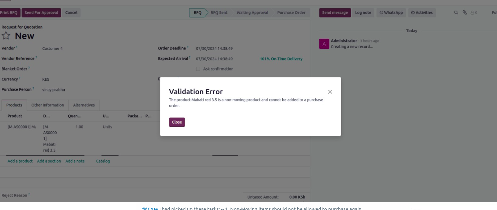

# Product Purchase and Return Validation Module

## Overview

This module introduces validation rules for creating purchase orders and managing product returns in Odoo 17. It prevents purchase orders for non-moving products and products that haven't sold at least 50% of the quantity within the clearance configuration. Additionally, the module sends email notifications to vendors when a return is created on a purchase order.

## Table of Contents

1. [Installation](#installation)
2. [Configuration](#configuration)
3. [Usage](#usage)
4. [Technical Details](#technical-details)
   - [Model Changes](#model-changes)
   - [Template/View Changes](#templateview-changes)
   - [Email Notification](#email-notification)
5. [Troubleshooting](#troubleshooting)
6. [License](#license)

## Installation

### Steps

1. Add the module custom_po_creation to your custom modules list.
2. Navigate to Apps in Odoo, click on "Update Apps List," and then "Update."
3. Search for the module and install it.
4. Upgrade the module

## Configuration
Navigate to **Inventory** -> **Products** -> **Products**.
 
Non-moving Product Settings
1. Set Flag  **Is Non-Moving**
2. Set up Non-moving Period (in days)

Clearance Settings
1. Set Flag  **Track Stock Clearance**
2. Set up Track Days 

## Usage

1. **Creating a Purchase Order:**
   - When attempting to create a purchase order for a product, the system checks if the **Non-moving** flag is enabled. If enabled and no moves have been recorded for the product, a validation error will be raised, indicating that the product is non-moving and cannot be ordered.
   - Additionally, the system verifies if at least 50% of the product quantity, as specified in the clearance configuration, has been sold. If less than 50% has been sold, a validation error will be raised, notifying the user that there is still significant stock remaining.
    
    
    

2. **Creating a Return on a Purchase Order:**
   - Upon creating a return, an email notification will be sent to the vendor associated with the purchase order, informing them of the return.

    

## Technical Details

### Model Changes
- **Product Template**: 
  - Added a boolean field `is_non_moving_product` to indicate if a product is non-moving.
  - Added a boolean field `non_moving_period_days` to indicate period which we should track product moves.
  - Implemented validation logic to check for moves and the percentage sold.
  - Added a boolean field `track_stock_clearance` to indicate if a product is clearance should be tracked.
  - Added a boolean field `track_days` to indicate period within which we should track_stock.
  - Implemented validation logic to check for moves and the percentage sold.
- **Purchase Order Line**:
  - Added logic to validate products against non-moving and clearance criteria .
- **Stock Picking**:
  - Implemented functionality to trigger email notifications upon creating a return.

### Template/View Changes
- **Product Form View**:
  - Added the custom fields required for non-moving and stock clearance logic
- **Email Template**:
  - Format for email sent on PO return

## Troubleshooting

1. **Validation Error on Purchase Order Creation**: Ensure that the non-moving flag is correctly set on the product and that the clearance criteria are met.
2. **Email Notifications Not Sent**: Check email server configurations and ensure that vendor contact information is accurate.

## License

LGPL-3
